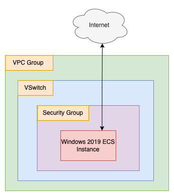

# Chrome On Windows

Script Last Tested On: 2019-06-20 (YYYY-MM-DD)

## What

This terraform script sets up a Windows Server 2016 instance and automatically installs the Chrome browser using a Powershell script, borrowed from [here](https://medium.com/@uqualio/how-to-install-chrome-on-windows-with-powershell-290e7346271). 

Once the script has run, it outputs login information, so that you can log into the newly created ECS instance using an RDP client.

Directory contents:

```
.
├── README.md
├── diagrams
│   ├── chrome_on_windows.png
│   └── chrome_on_windows.xml
├── install_chrome.ps1
├── main.tf
├── outputs.tf
└── variables.tf
```

The readme and diagrams (done using [draw.io](https://about.draw.io/)) are here for explanatory purposes. The files you probably care about are:

- main.tf (creates a VPC group, VSwitch, Security Group, and ECS instance, then installs Chrome)
- variables.tf (variables used in main.tf)
- outputs.tf (outputs the public IP, username, and password of the ECS instance, for RDP access)
- install_chrome.ps1 (fetches and installs Chrome)

## Why

Sometimes, you just need a remote desktop session somewhere else. Maybe for testing connectivity or load times for a website or application. And IE on Windows Server 2016 is painful to use, so you want Chrome.

## How

From your command line, "cd" into this directory. Then run:

```
terraform init
```

And then:

```
terraform plan
```

Check the output. It should show that a security group, VPC group, VSwitch, and ECS instance will all be created. Then run:

```
terraform apply
```

Type "yes" at the prompt, then hit enter. That's it! In a few minutes you'll have a working Windows Server 2016 desktop, with Chrome preinstalled.

## Notes and Warnings

**Note: If Chrome fails to install, you may need to change the URL referenced in `install_chrome.ps1`.** You can find the Chrome installation bundles [here](https://cloud.google.com/chrome-enterprise/browser/download/#download) on Google's site.

## Architecture

The "architecture" for this system is as follows:



The architecture is very simple. Only a single ECS instance, VSwitch, security group, and VPC group are created. The idea is to keep things as simple as possible here!