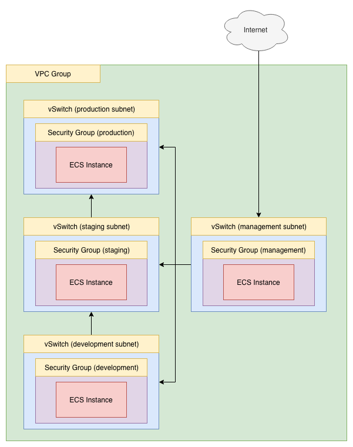

# Subnets: Development, Staging, and Production

## What

This terraform script sets up a new VPC group with four subnets (each with its own vSwitch):

- management
- development
- staging
- production

The script then launches 4 ECS instances, one in each subnet. The VPC group holding the 4 subnets has 4 different security groups, designed to restrict traffic into and out of each subnet. When the script runs, the ECS in the "management" subnet is bound to the "management" security group, the "development" ECS instance to the "development" security group, and so on.

For convenience rather than security, each of the 4 instances accepts login by password (as root) not by SSH key. The password for all 4 instances is the same, and is configured in variables.tf (or on the command line using the "-var" flag).

## Why

The script demonstrates how it is possible to configure security group rules to restrict traffic to flow in a certain direction between different subnets.

The rules in main.tf are configured like this:

management subnet:

- Traffic from the internet **IN** to the management subnet is allowed on port 22 (TCP only)
- Traffic from the management subnet **OUT** to the development subnet is allowed on any port and protocol
- Traffic from the management subnet **OUT** to the staging subnet is allowed on any port and protocol
- Traffic from the management subnet **OUT** to the production subnet is allowed on any port and protocol

development subnet:

- Traffic from the management subnet **IN** to the development subnet is allowed on any port and protocol
- Traffic from the development subnet **OUT** to the staging subnet is allowed on any port and protocol

staging subnet:

- Traffic from the management subnet **IN** to the staging subnet is allowed on any port and protocol
- Traffic from the development subnet **IN** to the staging subnet is allowed on any port and protocol
- Traffic from the staging subnet **OUT** to the production subnet is allowed on any port and protocol

production subnet:

- Traffic from the management subnet **IN** to the production subnet is allowed on any port and protocol
- Traffic from the staging subnet **IN** to the production subnet is allowed on any port and protocol

This results in an architecture where:

- Traffic flow from development -> staging -> production is one-way
- Management (bastion host) can connect to hosts in any other subnet, but those other subnets cannot initiate an inbound connection to the management subnet (bastion host)

## How 

From your command line, "cd" into this directory. Then run:

```
terraform init
```

And then:

```
terraform plan
```

Check the output. It should show that a security group, VPC group, vSwitch, and ECS instance will all be created. Then run:

```
terraform apply
```

Say "yes" to the prompt. That's it! In a few minutes you'll have a working "demo" environment. Log into the management ECS and from there you will be able to SSH into the production, development, and staging instances. You can run "ping" to ensure that traffic flow matches the architecture diagram below.  

Once you are satisfied that the security group rules are working, you can destroy the environment:

```
terraform destroy
```

## Architecture

Once `terraform apply` has run successfully, you end up with an architecture that looks like this:



Note the direction of the arrows between subnets.