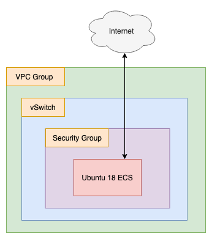

# Stress Test: Performance and Network Testing

Script Last Tested On: 2019-06-20 (YYYY-MM-DD)

## What

This terraform script sets up a single ECS instance and installs some stress testing and network performance testing tools (iperf, stress).

- iperf is used for network throughput testing
- stress is used to create arbitrary CPU, memory, and disk loads

The "stress" tool is there mostly for testing things like auto scaling group rules and monitoring/alerts (i.e. test that you receive an email if CPU load climbs above X% for Y minutes).

## Why

Network performance is important when choosing a cloud provider. Automated alerts and management are also important. If you need an easy way to test these things, this script is your friend.

## How 

From your command line, "cd" into the directory hodling this README, and then run:

```
terraform init
```

And then:

```
terraform plan
```

Check the output. It should show that a security group, VPC group, VSwitch, and ECS instance be created. Once you have confirmed that all the necessary resources will be created, run:

```
terraform apply
```

Say "yes" to the prompt. That's it! In a few minutes you'll have a working environment. Log into the instance to start iperf or run the "stress" command. 

When you are done with your tests, run:

```
terraform destroy
```

## Notes and Warnings

You can log into the instance like so:

```
ssh -i name_of_key.pem root@instance_ip_address
```

**However**, you may need to restrict the permissions on the .pem file to avoid an angry warning from SSH. You can do that like so:

```
chmod go-rwx name_of_key.pem
```

Also, **the SSH key .pem file will not be deleted when you call `terraform destroy`**. You must remove it by hand.

## Architecture

Once `terraform apply` has run successfully, you end up with an architecture that looks like this:


